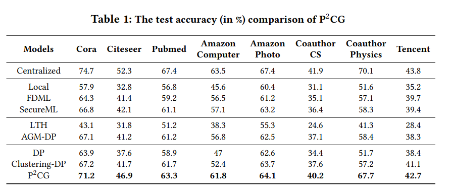

# P2CG: A Privacy Preserving Collaborative Graph Neural Network Training Framework.

This repository is the official implementation of P2CG. 

## Requirements

To install requirements:

```setup
pip install -r requirements.txt
```


## Training

To train the model(s) in the paper:
- cd the example dir.

- run the three ipynb notebook files (e.g. “test.ipynb”)

## Results

The end to end comparison result is:

